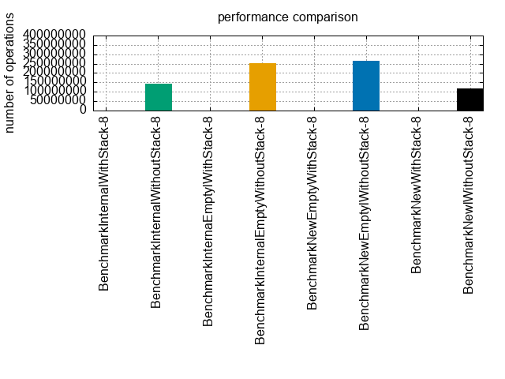

# AErrors

This is a fork of @stackus's [errors](https://github.com/stackus/errors/tree/master). I'll be maintaining this version for my own use.

## Installation

    go get -u github.com/htquangg/aerrors

## Prerequisites

Go 1.22

## Benchmarks

```shell
▶ go test ./... -test.run=NONE -test.bench=. -test.benchmem
goos: darwin
goarch: arm64
pkg: github.com/htquangg/aerrors
BenchmarkInternalWithStack-8              447028              2658 ns/op            1768 B/op         13 allocs/op
BenchmarkInternalWithoutStack-8         367436594                3.258 ns/op           0 B/op          0 allocs/op
BenchmarkNewWithStack-8                   444240              2638 ns/op            1656 B/op         13 allocs/op
BenchmarkNewlWithoutStack-8             365891073                3.265 ns/op           0 B/op          0 allocs/op
BenchmarkRawWithStack-8                   445426              2623 ns/op            1656 B/op         13 allocs/op
BenchmarkRawWithoutStack-8              361526726                3.313 ns/op           0 B/op          0 allocs/op
```



## Credit:
Based off work in:

- [stackus/errors](https://github.com/stackus/errors/tree/master)
- [pacman/errors](https://github.com/segmentfault/pacman/tree/main/errors)
